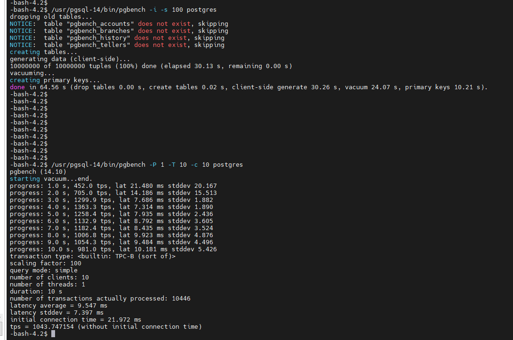

#TEST

__sql__

--
sqlsdfdsdfs

--

```
sdf
```

>test

>>sds

---

__link to tutorial__ [https://www.youtube.com/watch?v=syrGPPekLHQ](https://www.youtube.com/watch?v=syrGPPekLHQ)

---




val | val | cal |
|:------|:---|:---:
asd | 165 | ada 
asdqw | sds | sdsds 
sfsf | esfs | sefgsf 

\# without

termin
    : termin description


